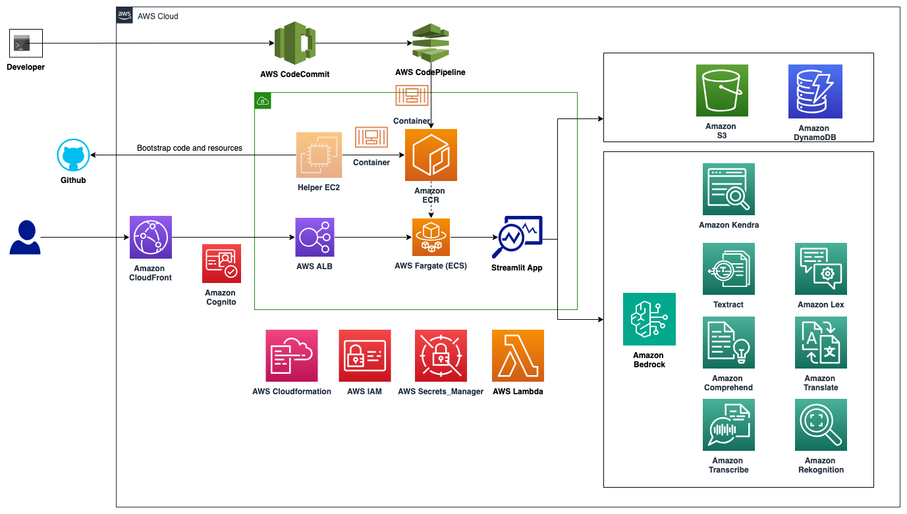

# README

## The AWS Gen AI Demo Showcase

This GenAI demo showcase consists of multiple demos which demonstrates the art of the possible with Generative AI using AWS services. We have started with 6 popular Gen AI demos demonstrating AWS AI services along with Amazon Bedrock. By deploying this solution, you can explore the power of these services and how they can be integrated to solve various business challenges.

## Design

The code for the demos is built with Python and calls API’s for various services in your AWS account. The front end  uses [Streamlit](https://streamlit.io/). The bundled code package is available in this Github repository <link> or as a standalone package. 

Users begin with a AWS CloudFormation template that picks up the related sample application code package from a github repository or from an user managed S3 bucket specified in the input parameters. The stack then builds a Docker image using the code base on a temporary EC2 instance and uploads the docker image to Amazon ECR (Elastic Container Registry). Lambda functions used for Amazon SageMaker Jumpstart deployment and S3 bucket cleanup on deletion of stack are also built on same EC2 instance. The CloudFormation script then creates the additional infrastructure required like ECS Cluster, Fargate Task Definitions to run the docker image as a ECS managed container. Users can update the sources and deploy the package on Amazon ECS Fargate using the Code* tools ( Code Build, Code Commit, Code Pipeline and Code Deploy). 

The template then provisions additional services needed for the demos like IAM Roles, Kendra, Dynamo DB, S3 Buckets for sample data or storing test results, Amazon ALB and CloudFront to make the solution available via the web securely. The Sample Demo application would be accessible via CloudFront with user authentication managed by Cognito. 

In this version of the Demo Showcase, we have selected the most popular demos and we are supporting some of the Amazon Bedrock models only for the demos. In future versions, we will add additional models as well as demos.

Below is the architecture design of the solution:

Note: CICD setup is not included in this template.

Refer to the following for:
* [Deployment](./docs/install.md)
* [Accessing App](./docs/testing.md)

### Customizing the samples
If user is interested in modifying the samples or adding more customized usecases, this would require recreation of the Docker image of the streamlit app and uptaking it in ECS. There are two scripts available to recreate the ECS Docker image and push ECS to uptake the changed docker image. Edit the following scripts with correct region, stack id and run with AWS creds from command line.
  * `pushLatestDockerImage.sh`: shell script to push updated code as docker image for ECS. Edit the parameters as necessary before running the script. Needs AWS CLI, credentials and Docker along with access to the application code (run from directory where the *Dockerfile* exists).
  * `updateEcsService.sh`: shell script to update ECS to uptake any updated docker image or task definitions. Needs AWS CLI and credentials to update ECS.

There are two helper utiltiies that encapsulate the interactions with Bedrock and Cognito. **utils/gen_ui_selector.py** handles the model selection and invocation of various Bedrock models and **utils/congito_helper.py** handles the user registration/signup, authentication.

## License
This sample code and templates are made available under a modified MIT license. 
See the LICENSE file for more information. 
